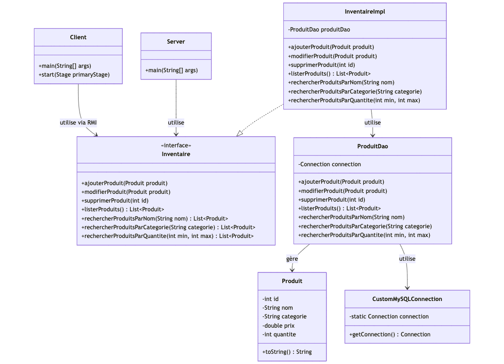
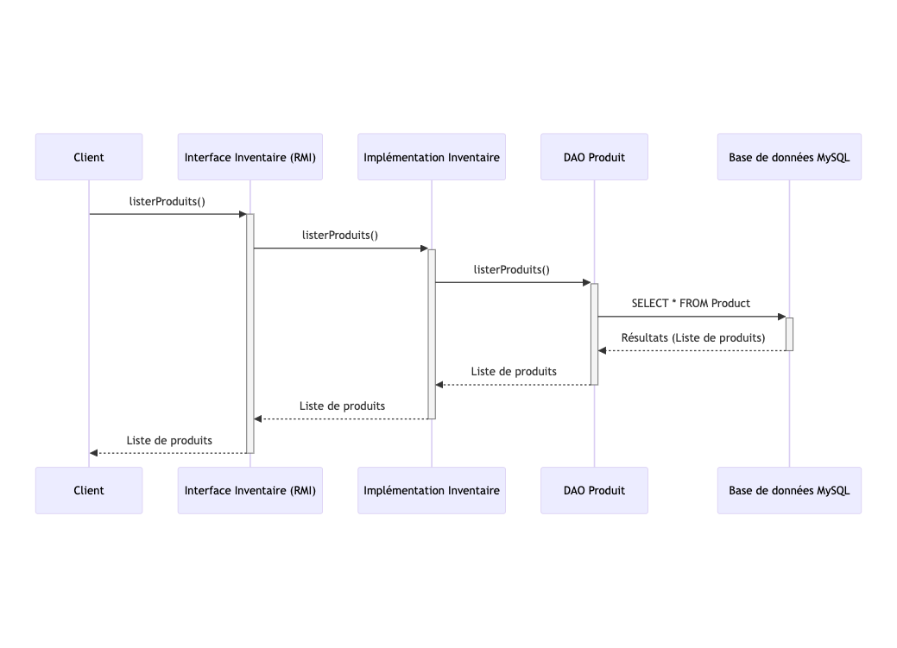

# Introduction

Ce projet a pour objectif de créer une application permettant une gestion de l'inventaire au sein d'une entreprise.
L'application sera devisé en deux partie :

- Serveur : assure la gestion de la connexion à la base de données et expose les fonctionnalités aux clients distants via RMI.
- Client : offre aux utilisateurs une interface graphique créée avec JavaFX, leur permettant d’interagir avec le serveur pour gérer l’inventaire.

# Architecture

## Diagramme UML

### Diagramme de class

Ce diagramme illustre un système de gestion d'inventaire basé sur Java RMI. Le **`Server`** expose les méthodes de l’interface **`Inventaire`** via RMI, et le **`Client`** interagit avec ces méthodes à distance. Les données des produits (**`Produit`**) sont gérées par **`ProduitDao`**, qui utilise une connexion MySQL via **`CustomMySQLConnection`**.


### Sequence diagram

Ce diagramme de séquence illustre le cas d’utilisation de la **liste des produits** dans le système. Le **Client** appelle la méthode distante `listerProduits()` via l’interface RMI **`Inventaire`**, qui délègue la demande à **`InventaireImpl`**. Ce dernier interroge la base de données via **`ProduitDao`** pour récupérer la liste des produits, qui est ensuite renvoyée au **Client**.


## Description de l’architecture

Ce projet utilise une architecture client-serveur basée sur **Java RMI**. Le serveur héberge l'objet distant **`InventaireImpl`**, accessible via le registre RMI, qui gère les opérations d'inventaire et délègue l'accès à la base de données MySQL via **`ProduitDao`**. Le client, avec une interface JavaFX, interagit avec l'objet distant pour effectuer des opérations comme lister ou gérer les produits.

# Explication technique :

## Fonctionnement des principales classes :

### Client

Fournit une interface graphique JavaFX pour que l’utilisateur puisse gérer l’inventaire.
Se connecte au serveur grâce à RMI et utilise les méthodes comme `listerProduits()` ou `ajouterProduit()`.

### Serveur

- Héberge la classe **`InventaireImpl`**, qui gère les opérations comme ajouter ou supprimer des produits.
- Publie cet objet dans un registre RMI pour qu’il soit accessible au client.

### Inventaire

- Interface qui définit les méthodes disponibles pour le client, comme la recherche ou la liste des produits.
- Elle est implémentée par **`InventaireImpl`** sur le serveur.

### ProduitDao

Permet d’interagir avec la base de données MySQL en exécutant des requêtes SQL (ajouter, modifier, supprimer, chercher des produits).

### CustomMySQLConnection

Fournit une connexion unique et centralisée à la base de données MySQL, en utilisant JDBC pour établir cette connexion.

## Justification des choix technologiques :

### Java RMI

Simplifie la communication entre le client et le serveur en permettant d'appeler des méthodes à distance.

### JDBC

Fournit une méthode simple et efficace pour interagir avec une base de données relationnelle.

### MySQL

Base de données fiable et populaire, adaptée pour gérer les données structurées

### JavaFX

Permet de créer une interface graphique claire et facile à utiliser pour l’utilisateur.

### Gradle

Simplifie la gestion des dépendances, la construction et l'exécution du projet, ce qui accélère le développement.

# Instructions d’installation et d’exécution

## Pré-requis

- Java 21
- MySQL 9.0
- Pas besoin d’installer Gradle grâce au Gradle Wrapper inclus dans le projet.

### Étapes pour configurer la base de données

Vous devez avoir un serveur MySQL, et un client comme phpMyAdmin pour connecter à la base de donnée

#### Paramètres de connexion

- Nom de la base de données : `inventaire`
- Port : `3306`
- Utilisateur : `root`
- Mot de passe :

(Le mot de passe est vide)

### Commandes ou configurations pour exécuter le serveur et le client

Cloner le projet depuis GitHub :

```bash
git clone https://github.com/boumediane1/inventaire.git
```

#### Étapes pour exécuter le serveur

Se déplacer dans le dossier `inventaire/serveur` et exécuter la commande :

```bash
gradlew clean build
```

Se déplacer dans le dossier `inventaire/serveur/app/build/classes/java/main` et exécuter la commande :

Lancer le registre RMI :

```bash
rmiregistry
```

Se déplacer dans le dossier `inventaire/serveur` et exécuter la commande :

Démarrer le serveur :

```bash
gradlew run
```

#### Étapes pour exécuter le client

Se deplacer dans le dossier `inventaire/client` et exécuter la commande :

```bash
gradlew clean run
```
